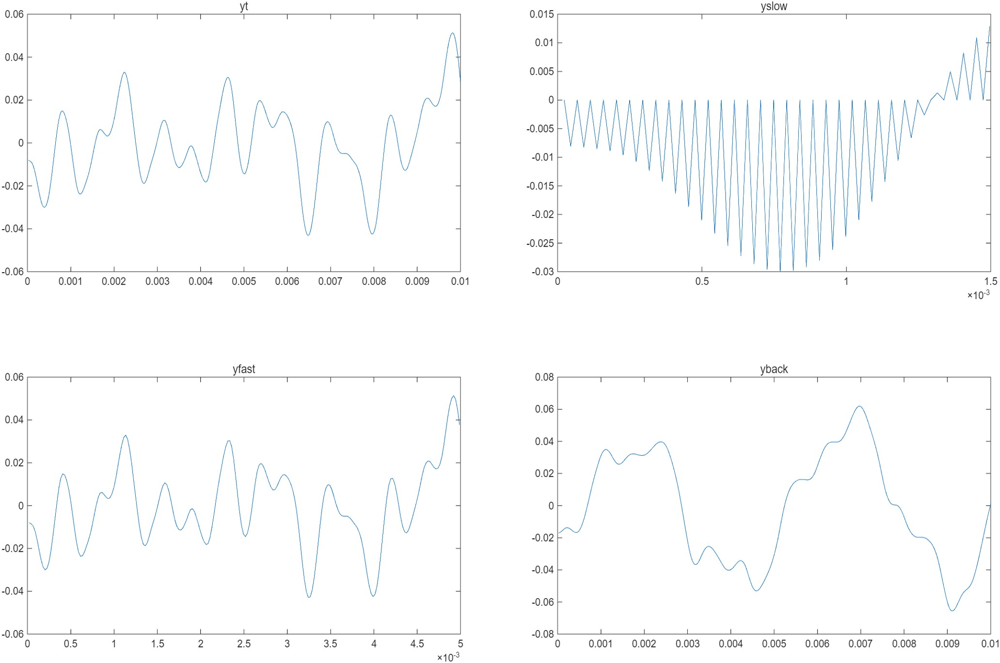
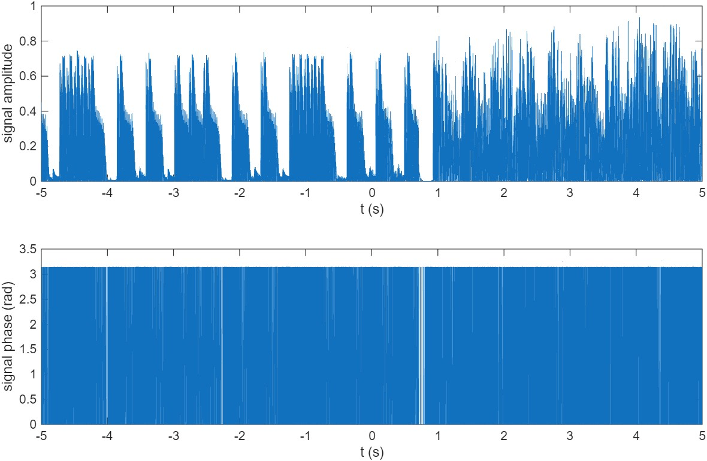
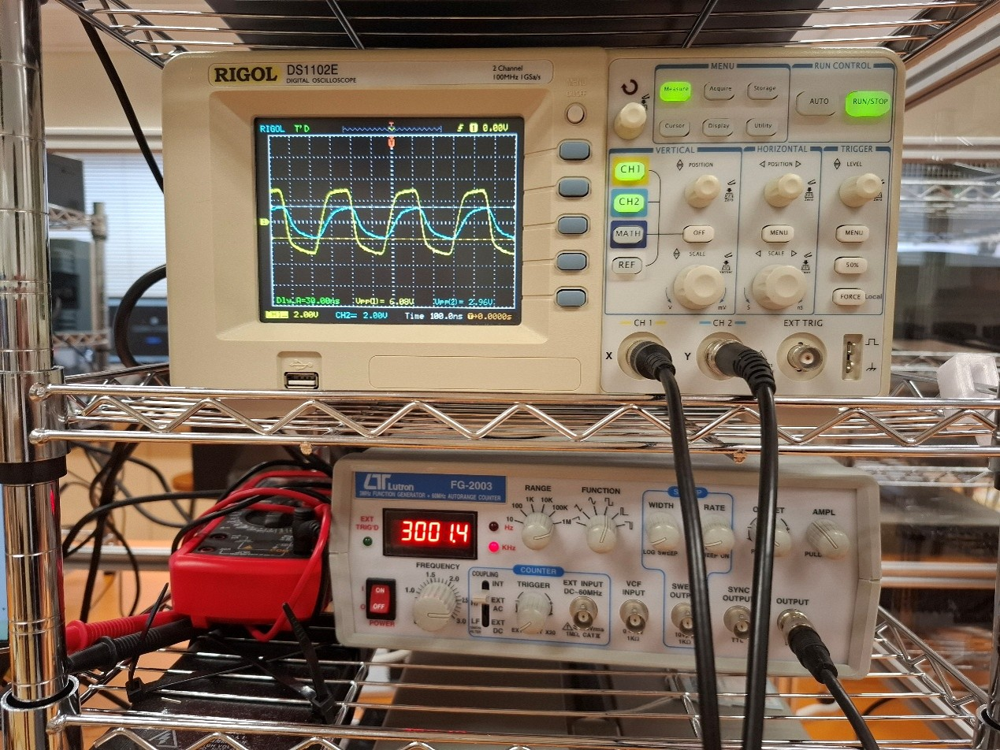

# Linear-Systems-and-Signal-Processing
This repository contains lecture notes, homework, and lab results of the Signals and Systems subject.

## Repository Structure

```
Linear-Systems-and-Signal-Processing/
├── Hw1/              # Phase modulation homework
│   ├── yback
│   │   └── yback.m  
│   ├── yfast
│   │   └── yfast.m  
│   ├── yslow
│   │   └── yslow.m
│   ├── yt
│   │   └── yt.m
│   └── Hw1.m            # Overall program for Hw1
├── Hw2/             # Filter development homework
│   ├── highpass_1kHz
│   │   └── highpass_1kHz.m  
│   ├── lowpass_1kHz
│   │   └── lowpass_1kHz.m  
│   └── lowpass_500Hz
│       └── lowpass_500Hz.m
├── Lab1             # Copper wires labortary    
├── Lab2/             # Simulations labortary of digital transmissions
│   ├── Documents 
│   ├── Figures
│   └── lab2.m  
├── Lecture notes                 
├── Sample Figures              # Displayed figures from documents
└── Tut                 # Tutorial materials sorted by the TA
```

## Environment Configuration
- MATLAB with the necessary toolboxes, especially Signal Processing Toolbox

## Hw1
1. In this exercise, you will be using the MATLAB program to get a sense of how x(2t), x(t/2) and x(-t) “sound” like, if x(t) is a piece of music.
2. x(2t) -> yfast, x(t/2) -> yslow, x(-t) -> yback
3. Each matlab program will plot the music waveform, play the music, and export the music file.



## Hw2
1. In this exercise, we will use MATLAB to develop different filters, including the low-pass filter and the high-pass filter, and see how these filters change your music.
2. Use "fft_PolyU.m" and "ifft_PolyU.m" to take Fourier Transform and Inverse Fourier Transform of signal.
3. Each matlab program will plot the music waveform, play the music, and export the music file.

The graph you get using fft_PolyU( ) should look like this:


After going through a low-pass filter with 1KHz cut-off frequency, your plot should look something like this:
<p align="center">
    
</p>

After reconstructing by using ifft_PolyU( ) back to the time domain, your plot should look something like this:


## Lab1
1. We will investigate how the shape of the transfer function and bandwidth of the piece of wire depends on length.

<p align="center">
    3MHz Square Waveform
</p>

## Lab2
1. In this lab, we are going to explore how noise affects the detection accuracy of a digital signal using binary and general Quadrature Amplitude Modulation (QAM) format. The entire process is illustrated in the following diagram.


2. semilogy( )creates a plot using a base 10 logarithmic scale for the y-axis and a linear scale for the x-axis. A sample figure is shown below.

